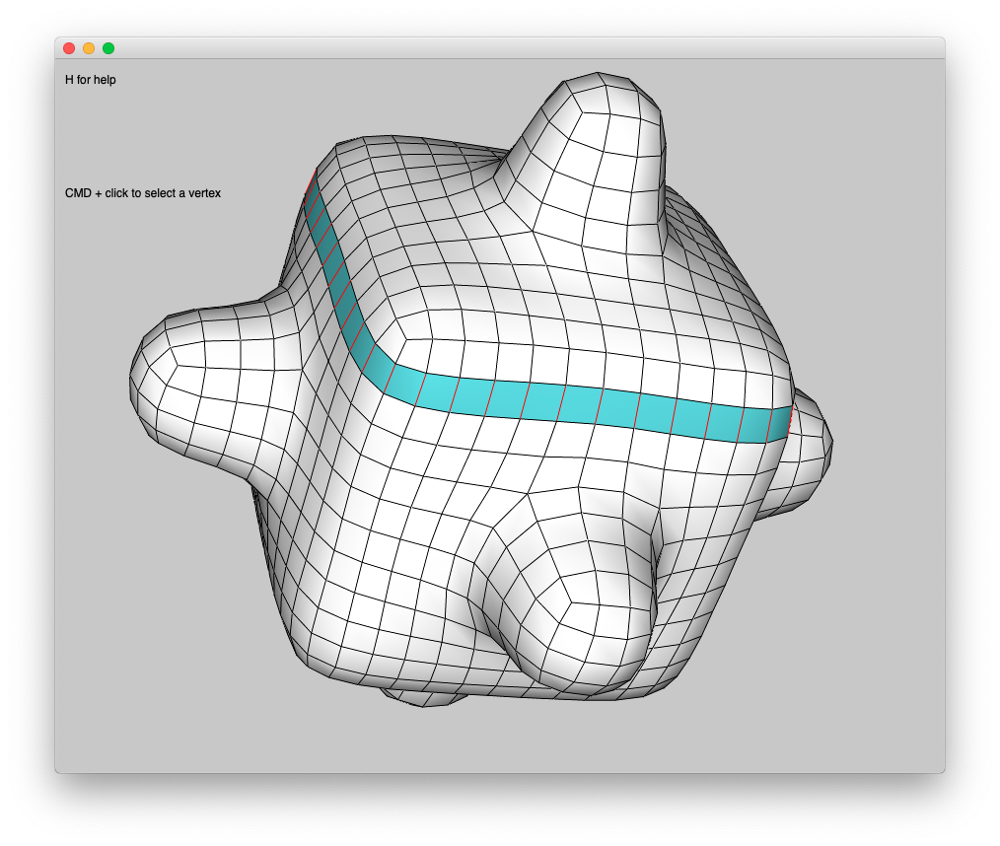
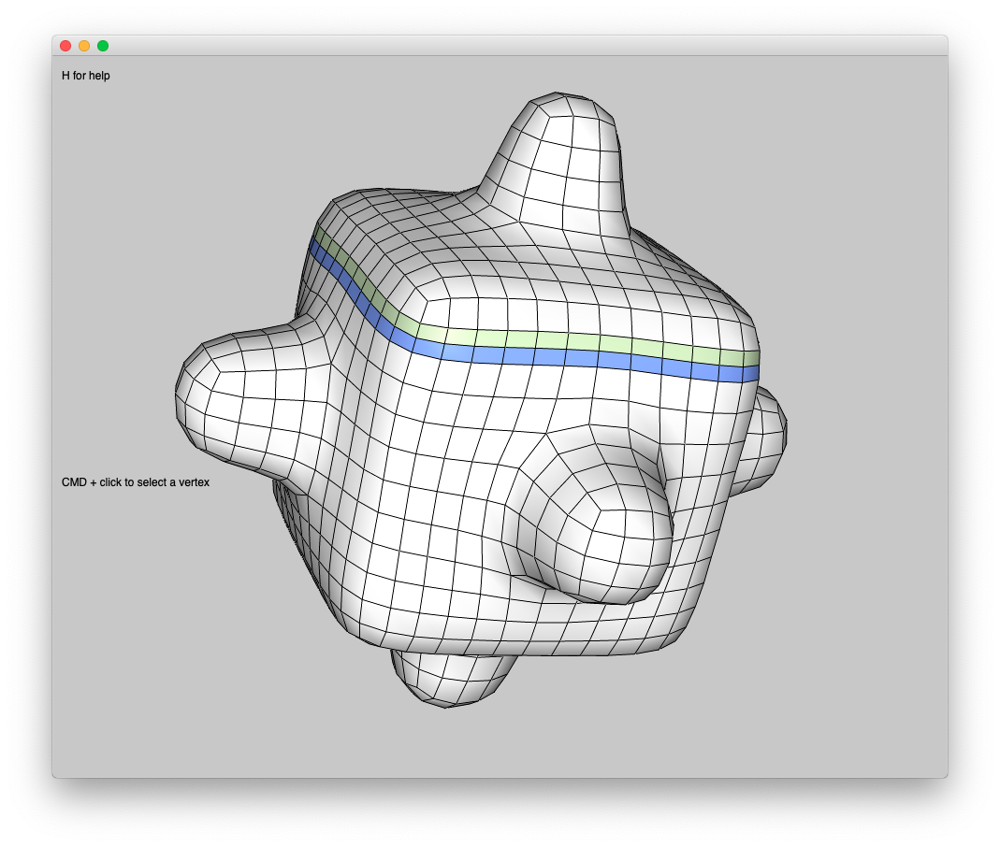

# BatTirocinio

---

Ripasso C++

* Sintassi generale
* Analogie con C e Java
* Progetti Qt


## Cinolib

---

Strutturazione delle classi riguardanti le mesh, la geometria e IO.

Gerarchia classi mesh:

	* abstract mesh
		* abstract polygonmesh
			* polygonmesh
			* quadmesh
			* trimesh
		* abstract polyhedralmesh
			* hexmesh
			* polyhedralmesh
			* tetmesh

Attributi principali delle mesh:

* vertici -> salvati come vec3d
* poligoni -> salvati come vettori di uint, dove gli uint rappresentano l’indice dei vertice
*  (edge) -> salvati in un vettore di uint, calcolati implicitamente dai vertici


## Trasformazioni geometriche

---

Le trasformazione geometriche sono state approcciate inizialmente modificando “manualmente” vertici e poligoni, nonostante la mesh abbiano già i metodi implementati per queste trasformazioni, con lo scopo di capire in che modo sono salvati i dati in cinolib. La risoluzione di questi problemi è stata implementata su mesh di superficie, ma il procedimento è analogo per le mesh volumetriche.

### Traslazione

> A traslazione è un movimento rigido della mesh nello spazio tridimensionale, in modo tale che ogni retta passante tra due vertici qualsiasi mantenga la stessa direzione prima e dopo il movimento.

Matematicamente rappresentiamo la traslazione o come vettore di 3 elementi o come ultima colonna della matrice di trasformazione 4x4, a livello di codice lo rappresentiamo come vec3d.
```
Matrice 4x4				Vettore			Risultante
o o o x					x				vx+x
o o o y					y				vy+y
o o o z					z				vz+z
o o o o
```

Possibili approcci per effettuare la traslazione:

**Soluzione già implementata:** cinolib prevede già un metodo pr le mesh di traslazione a cui basta passare un vec3d rappresentante la traslazione .

``` cpp
void translate(const vec3d &delta);
```

**Approccio ad alto livello:** è stato implementato l’overload dell’operatore + tra vec3d, quindi basta fare un ciclo in cui si somma ad ogni vertice il vettore di traslazione.

``` cpp
for(auto &v : mesh.vector_verts())
	v += traslazione;
```

**Approccio a basso livello:** i vec3d (vertici) hanno un metodo set che permette di impostare i valori delle coordinate, si può quindi utilizzare questo approccio:

``` cpp
for(auto &v : mesh.vector_verts())
	v.set(v.x()+traslazione.x(), v.y()+traslazione.y(), v.z()+traslazione.z());
```

Si sarebbe potuto anche usare un approccio ancora più basso andando a modificare uno per uno gli attributi della classe, ma questi sono privati, quindi questo approcci non è attuabile.

### Scalatura

> La scalatura è una trasformazione che prevede l’aumento della distanza proporzionale tra tutti i vertici della mesh lungo i tre assi.
> Se le proporzioni vengono mantenute, quindi il fattore di scalatura è uguale su tutti e tre gli assi, si parla di scalatura uniforme (o isotropica), mentre se abbiamo un fattore di scalatura diverso tra i diversi assi parliamo di scalatura non uniforme (o anisotropica).

Matematicamente possiamo rappresentare anch’essa come vettore di 3 elementi, il quale verrà poi moltiplicato per il vettore delle coordinate del punto da scalare, oppure come diagonale della matrice di trasformazione 3x3 o 4x4.
```  
Matrice 4x4			Matrice 3x3				Vettore			Risultante
x o o o				x o o					x				vx·x
o y o o				o y o					y				vy·y
o o z o				o o z					z				vz·z
o o o o
```

**Approcci per la scalatura:**
**Soluzione già implementata:** cinolib prevede già un metodo per le mesh di scalatura isotropica a cui basta dare un fattore di scala.

``` cpp
void  scale(const double scale_factor);
```

**Approccio generale:** si può implementare una scalatura grazie ad una matrice di trasformazione 3x3 e alla funzione  tranform da applicare ai vec3d (vertici), in questo modo possiamo effettuare sia una scalatura isotropica che anisotropica, mentre il metodo scale della cinolib prevede solo scalature isotropiche.

``` cpp
double scale[3][3] = {{s_x,0,0},
                      {0,s_y,0},
                      {0,0,s_z}};
for(auto &v : mesh.vector_verts())
	transform(v,scale);
```

### Rotazione

> La rotazione è una trasformazione del piano o dello spazio euclideo che sposta gli oggetti in modo rigido e che lascia fisso un punto (nel caso di un piano) o una retta (nel caso dello spazio). Il punto o retta che rimangono fissi nella trasfomazione prendono il nome rispettivamente di centro e asse della rotazione.
>
> Gli elementi della rotazione sono:
>
> * il verso
> * l'ampiezza di rotazione
> * il centro di rotazione

Matematicamente la rappresentazione delle rotazioni può avvenirte in vari modi: matrici 3x3, angoli di elusero, asse+angolo, quaternioni.

La matrice di trasfomazine varia in base all'asse in cui vogliamo ruotare:
$$
Asse\ x\ 
\begin{bmatrix}
1 & 0 & 0\\
0 & \cos(\theta) & -\sin(\theta)\\
0 & \sin(\theta) & \cos(\theta)
\end{bmatrix}
\ \ \ \ \ \ 
Asse\ y\ 
\begin{bmatrix}
\cos(\theta) & 0 & \sin(\theta)\\
0 & 1 & 0\\
-\sin(\theta) & 0 & \cos(\theta)
\end{bmatrix}
\ \ \ \ \ \ 
Asse\ z\ 
\begin{bmatrix}
\cos(\theta) & -\sin(\theta) & 0\\
\sin(\theta) & \cos(\theta) & 0\\
0 & 0 & 1
\end{bmatrix}
$$


**Approcci per la rotazione:**
**Soluzione già implementata:** cinolib prevede una funzione di rotazione che utilizza il metodo asse + angolo, in cui l'asse è rappresentato da un vec3d, mentre l'angolo da un double.

```cpp
void  rotate(const vec3d & axis, const double angle);
```

**Approccio con le matrici:** si può implementare la rotazione in una maniera un po' più "rustica" grazie all'ausilio delle matrici 3x3 e l'ausilio della funzione tranform da applicare ai vec3d (vertici). ==NB: il risultato cambia in base all'ordine in cui si applicano le matrici di trasfomazine, non si tratta di un operazione commutativa==

```cpp
//rotazione asse x
double angle = 0;
double rotate[3][3] = { {1,         0,           0 },
                        {0, cos(angle), -sin(angle)},
                        {0, sin(angle),  cos(angle)}};
                        
transform(v,rotate);
```

```cpp
//rotazione asse y
double angle = 0;
double rotate[3][3] = { { cos(angle),  0, sin(angle)},
                        {          0,  1,         0 },
                        { -sin(angle), 0, cos(angle)}};
                        
transform(v,rotate);
```

```cpp
//rotazione asse z
double angle = 0;
double rotate[3][3] = { {cos(angle),    -sin(angle),    0},
                        {sin(angle),    cos(angle),     0},
                        {0,             0,              1}};
                    
transform(v,rotate);
```


## Fusione mesh

---

L'obiettivo è fondere due mesh in una unica, non tenendo conto della possible compenetrazine di queste due.
I problemi da risolvere sono:

- aggiunta dei vertici alla mesh
- aggiunta dei poligoni alla mesh (in particolare i poligoni della seconda mesh)
- aggiunta degli edge (in particolare della seconda mesh, ma in realtà è fatto in automatico nel momento dell'aggiunta dei poligoni)

Come primo passo o si usa una mesh vuota di partenza, in cui si copia la prima mesh, oppure si utilizza la prima mesh direttamente come base.
Una volta preparata la "base di partenza" inizia la parte critica, cioè quella di unione.

Per ottenere il nostro risutlato andremo ad utilizzare il metodi ```.vert_add(vec3d vert)``` e ```.poly_add(std::vector<uint> poly)``` che prendono rispettivamente un vertice e un vettore di indici di vertice.

Il primo problema si presenta dopo l'aggiunta dei vertici della seconda mesh, quando dobbiamo aggiungere i poligoni, per cui dobbiamo ricavare l'indice: ci salviamo in numero di vertici della prima mesh (offset) e lo aggiungiamo all'indice di ogni vertice in ogni poligono.
Dopo questa operazione possiamo aggiungere i poligoni.

```cpp
//calcolo offset
uint offset = mesh1.num_verts();

//aggiunta vertici
for(vec3d &v: mesh2.vector_verts()){
    mesh1.vert_add(v);
}

//aggiunta poligoni
for(vector<uint> &v: mesh2.vector_polys()){
  //aggiunta offset indici mesh2  
  for(uint &x: v) {
        x += offset;
  }
  mesh1.poly_add(v);
}
```

==Questo approccio funziona solo con le mesh di superficie, in quanto nel vettore di vettori restituito da ```.vector_polys()``` gli uint rappresentano gli indici dei vertici che compongono il poligono, mentre con le mesh volumetriche rappresentano gli indici delle facce che compongono il poliedro==

Per questo motivo andiamo a correggere l'algoritmo riportato qui sopra, in modo che funzioni sia con le mesh di superficie che con quelle volumetriche:

```cpp
//calcolo offset e vettore ausiliario
uint offset = m.num_verts();
std::vector<uint> vertPolys;

//aggiunta dei vertici
for(auto &v : m2.vector_verts()){
  m.vert_add(v);
}

//aggiunta dei poligoni
for(uint i=0; i<m2.num_polys(); i++) {
  vertPolys = m2.poly_verts_id(i);

  for(auto &v : vertPolys)
    v += offset;

  m.poly_add(vertPolys);
}
```

Da notare che ```.poly_add()``` nel caso delle mesh volumetriche prende un vettore di uint, dove questi ultimi rappresentano i vertici del poliedro (come succede con le mesh di superficie), ma il funzionamento è differente: non solo verranno aggiunti gli edge, ma anche le facce verranno aggiunte automaticamente e saranno gli indici di queste ultime a comporre il vettore dei poligoni (vedi anche parte evidenziata sui sopra).


---

---

---


## Progetto tesi: operatori compressione e decompressione

---

Nel progetto di tesi si andranno a sviluppare due operatori, uno inverso all'altro.

Il primo operatore permette, data una hexmesh, di selezionare un livello, cioè tutti gli esaedri "complanari" (il termine è un po' improprio ma rende l'idea) ed eliminarli, dopo averli eliminati si devono ricongiungere le due parti di mesh rimaste sconnesse a causa dell'eliminazione del livelli di esaedri.

L'operatore opposto invece permette sempre di selezionare un livello, ma, anziché togliere il "piano" di esaedri, si va ad aggiungere un "foglio" di esaedri e quindi si va a "pompare" una hexmesh aggiungendo un livello.

### Approccio

Come prima cosa si dovrà selezionare un livello, quindi andremo a selezionare un esaedro e di questo due coppie di facce opposte in quando possiamo selezionare due livelli per ogni esaedro.

La selezione avviene per adiacenza, quindi, data ogni faccia che definisce il livello, si va a vedere l'altro esaedro adiacente a quella faccia e si tagga, per poi proseguire con l'esaedro appena trovato e trovare gli altri esaedri adiacenti con le stesse modalità.

Una volta riusciti a selezionare il livello si andrà a "pompare" o eliminare il livello.

Per pompare il livello si può agire in due maniere:

- Inserire effettivamente un foglio di esaedri tra il livello selezionato e la porzione di mesh sopra o sotto questo livello
- Andare a "spezzare" il livello selezionato in due livelli, in modo da aggiungere un nuovo livello "sdoppiando quello già esistente"

Per eliminare quel livello invece si deve andare a "ricongiungere" poi le due porzioni di mesh sopra e sotto quel livello, idealmente andando a far combaciare le due faccie opposte a contatto con l'esterno del livello e poi eliminando una delle due.

### Risolviamo prima il problema con surface mesh

#### Picking

L'approccio ed il ragionamento sono i medesimi, ma anziché andare a lavorare di faces andremo a lavorare di edges.

Iniziamo con la selezione di un livello di mesh utilizzando lo strumento di picking in modo da selezionare un edge.

```cpp
//esempio cinolib modificato per pickare edges

Profiler profiler;

gui.callback_mouse_press = [&](GLcanvas *c, QMouseEvent *e)
{
  if (e->modifiers() == Qt::ControlModifier)
  {
    vec3d p;
    vec2i click(e->x(), e->y());
    if (c->unproject(click, p)) // transform click in a 3d point
    {
      profiler.push("Pick Edge");
      uint eid = m.pick_edge(p);
      profiler.pop();
      m.edge_data(eid).color = Color::RED();
      m.updateGL();
      c->updateGL();
    }
  }
};
```

In questo frangente andiamo ad attribuire un colore all'edge pickato, piuttosto che un tag, in questo modo possiamo andare a selezionare tutto un livello di edges.

#### Selezione del livello

##### Approccio 1

Dopo aver individuato un edge possiamo andare a selezionare tutti gli edges paralleli a quello selezionato con la funzione ```.edge_parallel_chain(uint eid)``` e successivamente andare a selezionare tutti i poligoni tra adiacenti a questi edge.

```cpp
for(uint e : m.edge_parallel_chain(eid)) {
  m.edge_data(e).color = Color::RED();

  for(auto p : m.adj_e2p(e))
    m.poly_data(p).color = Color::PASTEL_CYAN();
}

m.show_poly_color();
```

Con il seguente risultato:



##### Approccio 2

In alternativa si poteva procedere nel seguente modo:
Dopo aver selezionato un edge si sarebbe andato selezionare i due quad adiacenti ad esso, successivamente si sarebbe potuto "camminare" per edge paralleli tramite la funzione ```.edge_opposite_to(uint pid, uint eid)```, prima da un lato, poi dall'altro, fino alla "fine" della mesh oppure fino a ritrovare lo stesso edge da cui si è partiti (nel secondo caso non servirà andare a percorrere la seconda direzione di edge paralleli).
Allo stesso modo, dopo aver selezionato tutti gli edge paralleli (o durante), andiamo a taggare tutti i quad per selezionare il livello.

```cpp
uint eid_chain, pid, pid_prev;

//PRIMO GIRO

//primo quad
pid_prev= m.adj_e2p(eid)[0];
m.poly_data(pid_prev).color = Color::PASTEL_CYAN();
//primo edge
eid_chain = m.edge_opposite_to(pid_prev, eid);
m.edge_data(eid).color = Color::RED();

do{
  //taggo l'edge
  m.edge_data(eid_chain).color = Color::RED();

  //scelgo il quad non ancora taggato
  pid = m.adj_e2p(eid_chain)[0];
  if (pid == pid_prev && m.adj_e2p(eid_chain).size() == 2)
    pid = m.adj_e2p(eid_chain)[1];
  else
    break; //caso in cui la mesh non sia chiusa

  //taggo il quad
  m.poly_data(pid).color = Color::PASTEL_CYAN();
  //vado avanti
  pid = pid_prev;
  eid_chain = m.edge_opposite_to(pid, eid_chain);

}while(eid != eid_chain);

//caso mesh non chiusa: dobbiamo andare a taggare l'altro verso rispetto alla partenza
if(eid != eid_chain) {

  //primo quad altro giro
  pid_prev = m.adj_e2p(eid)[1];
  m.poly_data(pid_prev).color = Color::PASTEL_CYAN();
  //primo adge altro giro
  eid_chain = m.edge_opposite_to(pid_prev, eid);

  do{
    //taggo l'edge
    m.edge_data(eid_chain).color = Color::RED();

    //scelgo il quad non ancora taggato
    pid = m.adj_e2p(eid_chain)[0];
    if (pid == pid_prev && m.adj_e2p(eid_chain).size() == 2)
      pid = m.adj_e2p(eid_chain)[1];
    else
      break; //caso in cui la mesh non sia chiusa

    //taggo il quad
    m.poly_data(pid).color = Color::PASTEL_CYAN();
    //vado avanti
    pid = pid_prev;
    eid_chain = m.edge_opposite_to(pid, eid_chain);

  }while(eid != eid_chain);
}

m.show_poly_color();
```

==QUESTA ROBA NON FUNZIONA==

##### Approccio finale

Per risolvere sempre il problema di efficienza per la quale andiamo a ritaggare poligoni ed edge già taggati, possiamo servircii di una struttura dati quale il set, che in automatico andrà a controllare se quel quad è già stato selezionato con una complessità computazionale di O(log n) e nel caso sia già presente non lo inserirà nuovamente.
Dopo aver inserito gli indici di tutti i quad interessati nel set andiamo a colorarli tutti in modo da visualizzare il livello interessato.

```cpp
std::vector<uint> edge_chain = m.edge_parallel_chain(eid);
std::set<uint> poly_chain;

for(uint e : edge_chain) {
  for(auto p : m.adj_e2p(e))
    poly_chain.insert(p);

  m.edge_data(e).color = Color::RED();
}

for(auto p : poly_chain)
  m.poly_data(p).color = Color::PASTEL_CYAN();

m.show_poly_color();
```

> Successivamente ho scoperto che è più comodo utilizzare un vettore anziché un set, sebbene sia l'approccio migliore, a casusa di funzioni che andranno utilizzate successivamente.
>
> Il codice quindi diventa:
>
> ```cpp
> std::vector<uint> edge_chain = m.edge_parallel_chain(eid);
> std::vector<uint> poly_chain;
> 
> for(uint e : edge_chain) {
> 	for(auto p : m.adj_e2p(e))
>     if(DOES_NOT_CONTAIN_VEC(poly_chain,p)) /* COSÌ UTILIZZIAMO LA LISTA COME UN SET*/
>       poly_chain.push_back(p);
> }
> ```
>
> È stata rimossa anche l'attribuzione dei colori, in quanto l'importante è che i poligoni siano salvati da qualche parte, non è necessario che siano colorati, anche perché tra poco verranno rimossi.


#### Creazione dei nuovi vertici

Per al creazione dei sub-quad prima dobbiamo andare a creare i nuovi vertici che compongono questi quad.

Per la creazione di questi andremo a prendere la catena di edge che abbiamo salvato in precedenza e creeremo un vertice al centro di ognuno di questi edge (playsolder).

```cpp
std::map<uint, uint> new_e2v;

for(uint eid : edge_chain) {
	//creo un nuovo vertice
    double x = (m.edge_verts(eid)[0].x() + m.edge_verts(eid)[1].x()) / 2;
    double y = (m.edge_verts(eid)[0].y() + m.edge_verts(eid)[1].y()) / 2;
    double z = (m.edge_verts(eid)[0].z() + m.edge_verts(eid)[1].z()) / 2;
    vec3d new_vert(x, y, z);

    //aggiungo il nuovo vertice alla mesh e lo associo all'edge
    uint new_vid = m.vert_add(new_vert);
    new_e2v.insert(std::pair<uint, uint> (eid, new_vid));
}
```

Per salvare i nuovi vertici abbiamo utilizzato una mappa, in questo ogni vertice è associato ad ogni edge che spezza.


#### Creazione dei nuovi quad ed eliminazione dei vecchi

Per questo passaggio ci serviamo della catena di quad creata al primo passaggio.

Per ogni quad andiamo a capire in che verso dobbiamo tagliarlo, per fare ciò prendiamo il primo vertice (poteva essere uno qualsiasi dato che non sappiamo poi quale sia il primo vertice salvato) e i due edge ad esso incidenti.

Controlliamo quale dei due edge appartenga alla catena di edge calcolata precedentemente, di conseguenza capiamo anche il verso secondo la quale dobbiamo dividere in due il quad.

```cpp
for(auto pid : poly_chain) {

    if(CONTAINS_VEC(edge_chain, m.edge_id(m.poly_vert_id(pid,0), m.poly_vert_id(pid,1)))) {

        m.poly_add({m.poly_vert_id(pid,0),
                    new_e2v.at(m.edge_id(m.poly_vert_id(pid,0), m.poly_vert_id(pid,1))),
                    new_e2v.at(m.edge_id(m.poly_vert_id(pid,2), m.poly_vert_id(pid,3))),
                    m.poly_vert_id(pid,3)});

        m.poly_add({m.poly_vert_id(pid,1),
                    m.poly_vert_id(pid,2),
                    new_e2v.at(m.edge_id(m.poly_vert_id(pid,2), m.poly_vert_id(pid,3))),
                    new_e2v.at(m.edge_id(m.poly_vert_id(pid,0), m.poly_vert_id(pid,1)))});

    } else {
        m.poly_add({m.poly_vert_id(pid,3),
                    new_e2v.at(m.edge_id(m.poly_vert_id(pid,0), m.poly_vert_id(pid,3))),
                    new_e2v.at(m.edge_id(m.poly_vert_id(pid,2), m.poly_vert_id(pid,1))),
                    m.poly_vert_id(pid,2)});

        m.poly_add({m.poly_vert_id(pid,0),
                    m.poly_vert_id(pid,1),
                    new_e2v.at(m.edge_id(m.poly_vert_id(pid,1), m.poly_vert_id(pid,2))),
                    new_e2v.at(m.edge_id(m.poly_vert_id(pid,0), m.poly_vert_id(pid,3)))});
    }

}

m.polys_remove(poly_chain);
```

I vertici della subquad vanno sempre aggiunti in ordine antiorario, poiché al contrario la normale verrebbe calcolata dall'altro lato e il poligono renderizzato al contrario.

Dopo aver aggiunto tutti i subquad possiamo andare a rimuovere quelli vecchi.


#### Risultato finale

Mettendo insieme tutti questi approcci abbiamo questo risultato:

```cpp
gui.callback_mouse_press = [&](GLcanvas *c, QMouseEvent *e)
{
    if (e->modifiers() == Qt::ControlModifier)
    {
        vec3d p;
        vec2i click(e->x(), e->y());
        if (c->unproject(click, p)) // transform click in a 3d point
        {
            profiler.push("Pick Edge");
            uint pick_eid = m.pick_edge(p);
            profiler.pop();

            //catena di edge
            std::vector<uint> edge_chain = m.edge_parallel_chain(pick_eid);

            //catena di poligoni e mappa nuovi vertici
            std::vector<uint> poly_chain;
            std::map<uint, uint> new_e2v;

            for(uint eid : edge_chain) {

                //catena quad
                for(auto p : m.adj_e2p(eid))
                    if(DOES_NOT_CONTAIN_VEC(poly_chain,p))
                        poly_chain.push_back(p);

                //nuovi vertici
                double x = (m.edge_verts(eid)[0].x() + m.edge_verts(eid)[1].x()) / 2;
                double y = (m.edge_verts(eid)[0].y() + m.edge_verts(eid)[1].y()) / 2;
                double z = (m.edge_verts(eid)[0].z() + m.edge_verts(eid)[1].z()) / 2;
                vec3d new_vert(x, y, z);

                //aggiungo il nuovo vertice alla mesh e lo associo all'edge
                uint new_vid = m.vert_add(new_vert);
                new_e2v.insert(std::pair<uint, uint> (eid, new_vid));
            }

            //creazione dei subquad
            for(auto pid : poly_chain) {

                //con questo if capiamo il verso in cui tagliare il quad
                if(CONTAINS_VEC(edge_chain, m.edge_id(m.poly_vert_id(pid,0), m.poly_vert_id(pid,1)))) {
                    m.poly_add({m.poly_vert_id(pid,0),
                                new_e2v.at(m.edge_id(m.poly_vert_id(pid,0), m.poly_vert_id(pid,1))),
                                new_e2v.at(m.edge_id(m.poly_vert_id(pid,2), m.poly_vert_id(pid,3))),
                                m.poly_vert_id(pid,3)});
                    m.poly_add({m.poly_vert_id(pid,1),
                                m.poly_vert_id(pid,2),
                                new_e2v.at(m.edge_id(m.poly_vert_id(pid,2), m.poly_vert_id(pid,3))),
                                new_e2v.at(m.edge_id(m.poly_vert_id(pid,0), m.poly_vert_id(pid,1)))});
                } else {
                    m.poly_add({m.poly_vert_id(pid,3),
                                new_e2v.at(m.edge_id(m.poly_vert_id(pid,0), m.poly_vert_id(pid,3))),
                                new_e2v.at(m.edge_id(m.poly_vert_id(pid,2), m.poly_vert_id(pid,1))),
                                m.poly_vert_id(pid,2)});
                    m.poly_add({m.poly_vert_id(pid,0),
                                m.poly_vert_id(pid,1),
                                new_e2v.at(m.edge_id(m.poly_vert_id(pid,1), m.poly_vert_id(pid,2))),
                                new_e2v.at(m.edge_id(m.poly_vert_id(pid,0), m.poly_vert_id(pid,3)))});
                }
            }

            //rimozione poligoni
            m.polys_remove(poly_chain);

            m.updateGL();
            c->updateGL();
        }
    }
};
```

Risultato grafico:



